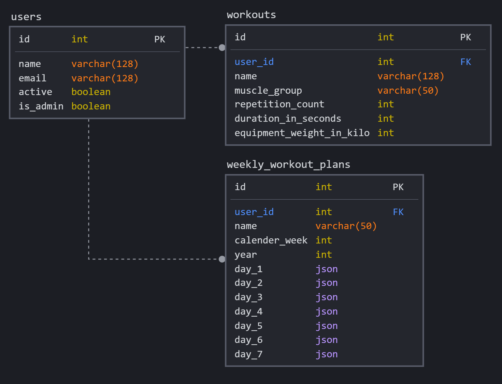
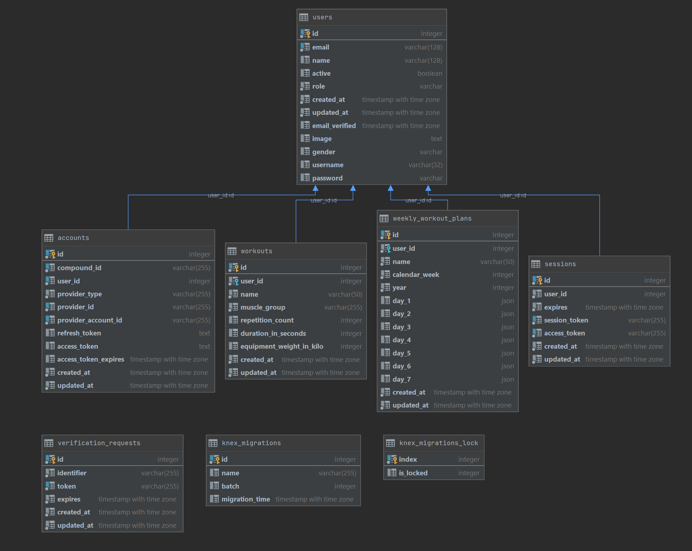
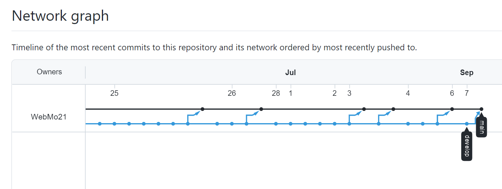

# 🏋️ Fitness Time - Workout Planner Backend

A lightweight backend enabling users scheduling and organization of fitness activities.

🌐 [VISIT LIVE API](https://fitness-time-webmo21.herokuapp.com/v1)

🖥️ [VISIT BACKEND REPOSITORY](https://github.com/WebMo21/webmo21-backend)

🎨 [VISIT FRONTEND REPOSITORY](https://github.com/WebMo21/webmo21-frontend)


## ✨ Features

- Provides running Node.js Backend with REST API
- Implemented full CRUD support for the 3 resources users, workouts and weekly-workout-plans with router, controller and service layer abstraction
- Authorization Middleware to secure API endpoints with differentiation between user and admin role
- Connection to Heroku PostgreSQL database working and fixed SSL error
- File structure following principles of clean code has been implemented in good faith
- Database migration files and example seeding data
- REST API has API tests persisted within within the thunder-tests folder for documentation and execution
- Provided structured documentation for the project
- Sending contact emails with nodemailer

## 🤖 Technologies

- [Express.js](https://expressjs.com) node backend server running providing a fast & minimalist REST API

- [Knex.js](http://knexjs.org) query builder used to handle migrations, seeding and connection to database
- [PostgreSQL](https://www.postgresql.org) relational database connected with the help of free hosting on [Heroku](https://heroku.com)
- Continuous Integration / Continuous Deployment Pipeline achieved with [Heroku](https://heroku.com)
- [Thunder Client](https://www.thunderclient.io) as an alternative to Postman for version controlled and easy documented REST API tests

## 💡 Development & Ideas

### 🏗️ Database Architecture

**First iteration**


**Final iteration**


For the final iteration several tables and columns had to be added, many of them were required for the authentication framework NextAuth.

The main tables representing the systems resource are:

- users

Since the authentication process is handled through Next-Auth.js with magic links for social media login and email magic links there is not a lot of data gathered from the users, only email and if social media is used also the name. On top of that `active` declares if a user is logically deleted since real deletion would not be compliant with regulatory rules and the `role` defined the authorization of a given user and carry the value `user` or `admin`.

- workouts

Users should be able to create custom workouts but also can select already created example workouts for themself. Only workout attributes and a foreign key to the user owning them is stored.

- weekly_workout_plans

During the design architecture some discussion about granularity came up but consensus was that each weekly workout plan is consisting of 7 possible workout days, a name, a year and which calender week it represents. In the backend users can be searched for all of their weekly_workout_plans and them sent to the frontend to be displayed in a calender view accordingly to their week. For each day there will be a json containing information about the individual workouts like tracking their completing, the real invested time, the scheduled time each of them should happen for the day and the id of the workout similar to this example:

```json
  "day_1": [
    { "workout_id": "17",
      "workout_completed": "no",
      "workout_tracked_time": "0",
      "workout_time_start": "13:00",
      "workout_time_end": "13:30"
    },
    { "workout_id": "24",
      "workout_completed": "no",
      "workout_tracked_time": "0",
      "workout_time_start": "13:30",
      "workout_time_end": "13:45"
    }
  ],
  "day_2": [
    { "workout_id": "13",
      "workout_completed": "no",
      "workout_tracked_time": "0",
      "workout_time_start": "11:00",
      "workout_time_end": "12:00"
    },
  ],
  "day_3": [],
  "day_4": [],
  "day_5": [],
  "day_6": [],
  "day_7": []
```

### Workouts and Assigned Workouts

Users can create individual workouts for themselves. From a architecture perspective there is a slight difference between workouts as they are and workouts which are assigned from a user and which data is saved where.

#### Workouts

Workouts are saved within the `workouts` table in the database. Elementary information about them are stored there which can be edited by the user in the specific view for that. These workouts act as building blocks that can be placed within many weeklyworkoutplans simultaneously. Thus it does not makes sense to store certain info in this table that belongs only to one individual weeklyworkoutplan for this workout but not to others like if it was completed in this week or at which time it starts and ends.

#### Assigned Workouts

To differentiate between workouts and workouts assigned into a specific weeklyworkoutplan extra information about a specific workout within this single week is stores within the `weekly_workout_plans` table in the JSON data of a specific day like `day_1`. Such data is weither this assigned workout was completed at which time it is scheduled to start and end and how long it took a user in reality.

### 📁 File Structure

- /api
  - Contains all files that are handling the API to be used by the frontend
  - /middleware
    - Contains middleware functions for authorizing users and admins for many API endpoints
  - /resources
    - Contains for each resource of the system (users, weekly-workout-plans and workouts) the router logic, the controller logic and the service layer logic. Each abstraction layer should only care about their dedicated job.
- /assets
  - Contains images to be displayed in the documentation
- /db
  - Contains various files to establish a connection to the database and store its configuration
  - /migrations
    - Contains files to be used for database schema migration
  - /seeds
    - Contains files to be used for inserted initial seed data dummy data into the database
  - thunder-tests
    - Contains REST API tests to document the API structure and make testing in error cases more easy by excluding the calling frontend as a source of error

### 📫 API Architecture

All resources of the system are split into three abstractions of seperations:

- Router
  - Defines which incoming HTTP request gets routed to which controller function by their HTTP method and route
  - Provides a clean overview for all available routes of a given resource
- Controller
  - Handles check of incoming and outcoming HTTP request and response data for an API call
  - It doesn't care about how the result is calculated or fetched and only cares about traffic
- Service Layer

  - Is the deep down business logic that assumes all data has been checked and parsed already by the controller level
  - Does the heavy lifting of algorithmic and database connection to provide the desired data for the HTTP request

- Middleware

  - Is written to be reusable and chained within the router level of any desired endpoint before the call of the controller level
  - Thus certain information like if the requested caller has sufficient access rights can be checked before any heavier calculation or data revealing functions are being executed and the request can be aborted immediately

- Extra Endpoints
  - Since the backend server production environment is hosted at Heroku's free tier servers it will be put asleep after a given inactive time and not be immediately response. As soon as the backend API is used again it will take 10-20 seconds and the server will be active and fast again. For the frontend this can be a bad user experience and could be avoided by paying a little amount per month easily.
  - To make the user experience a least a bit better another endpoint as been added within the `server.js` file that when the frontend landing page is visited the backend will be called immediately with an empty HTTP request doing nothing than waking up the sleeping backend server. By that there is a higher chance that before the users accesses the dashboard handling many backend requests a single call to the backend has already been made and it will be responsive very fast.
  - Also there is another endpoint for sending a contact email since it didn't really fit into a resource of the `api` folder.

### 📏 Rules & Convention

- Filenames should be using `kebab-case` so lowercase connected by a dash
- All media files like images have to be optimized and made as tiny as lossless possible before adding them to the project
- Prettier.js with team settings should be used for formatting all files to the same structure
- File indentation should be 2 spaces
- Naming of variables should be expressive and english
- Comments should only be used where necessary to explain higher level ideas of code since they age fast

### 🐛 Downsides & Known Bugs

- With the initialization of NextAuth some tables were automatically created to the database from the framework. The documentation should have been studied better in before and migrations should have been created and run first. Since this was not the case and the schema was extended by the framework itself some migrations were just written without every executing them first. So there is no guarantee that the current migrations are working 100% but they should be very close to a working solution and might need only minor tweaking.
- The seed files are in their initial state and have not been adapted to changes made later on during implementing the authentication framework.

## 🏠 Getting Started

### ⏹️ Prerequisites

The following applications should be installed before running this software.

```bash
Git
Node
```

### 🔧 Environment Variables

There are some environment variables needed weither the application should be run locally or in deployment.

```bash
DATABASE_URL=<Database Connection String here>

// There is a problem with Knex.js always use DEVELOPMENT
DEPLOYMENT="DEVELOPMENT"
PORT=5000
SERVER_URL=http://localhost:5000

EMAIL_SERVER_USER=<Email SMTP username here>
EMAIL_SERVER_PASSWORD=<Email SMTP password here>
EMAIL_SERVER_HOST=<Email SMTP host here>
EMAIL_SERVER_PORT=<Email SMTP port here>
EMAIL_FROM=<Mail adress that should appear as sender here>
```

When the backend is set up from scratch the database schema needs to be setup. To makes things easy and avoid unreadably long database dump files migration files have been used. To test if everything worked the seed files can be run to insert dummy data and check for errors.

## Working with Knex.JS Query Builder

### Creating new migration files

```bash
npx knex migrate:make init --migrations-directory db/migrations
```

### Running existing unmigrated migrations

```bash
npx knex migrate:latest --knexfile db/knexfile.js
```

### Running Seed Files

```bash
npx knex seed:run --knexfile db/knexfile.js
```

## Fixing SSL problems with Knex and Heroku PostgreSQL database

Configure the heroku app with the config var/environment variable:

```bash
PGSSLMODE=no-verify
```

````javascript
// in your knexfile.js
// Should come with install of pg
const parse = require("pg-connection-string").parse;
// Parse the environment variable into an object
const pgconfig = parse(process.env.DATABASE_URL);
// Add SSL setting to default environment variable
pgconfig.ssl = { rejectUnauthorized: false };
const db = knex({
  client: "pg",
  connection: pgconfig,
});```
````

### Run Backend In Development Environment

The development enviroment and start command uses the dependency [Nodemon](https://www.npmjs.com/package/nodemon) which hot reloaded the backend server on every saved file change to make testing easier.

```bash
git clone <Backend URL>
cd into project
npm install //to install dependencies
npm run dev //to start backend
visit http://localhost:5000 in browser or use frontend or thunder-test to check status
```

### Run Frontend in Production Environment

```bash
git clone <Backend URL>
cd into project
npm install //to install dependencies
npm start //to start backend
visit http://localhost:5000 in browser or use frontend or thunder-test to check status
```

## 🗼 Future Functionality

The next features which should be implemented are:

- Validation Middleware for usersIds and various structured objects
- Profile Picture File Upload
- Start and Track Workout Live View (Play Button in Navigation)
- More calendar interactions like drag and drop to reschedule a training plan or create a series of weekly training plans for a given time period

## 🧮 Organization

🔨 Tools

The Team (as visible below) worked together with a variety of different online tools to achieve the project outcome. Some of them are:

- [Visual Studio](https://code.visualstudio.com) Code as code editor of choice
- [Discord](https://discord.com) for communication & screen sharing useful for digital pair programming
- [Git](https://git-scm.com) for working together on the codebase

🌊 Git flow

We used Git Flow to merge code into the codebase with a structured order and keep feature of the software concise. Our design is the following:



- main branch (production environment)
- develop branch (develop environment)

## 👨 Team

|  |  |  |  |
| -------------------------------------------------------- | ---------------------------------------------------------- | ---------------------------------------------------------- | ------------------------------------------------------------- |
| Jakob Holz                                               | Onur Menekse                                               | Artur Kamrad                                               | [Sascha Majewsky](https://github.com/SaschaWebDev)            |

## 🔑 License

License under MIT License. See [LICENSE](https://github.com/WebMo21/webmo21-backend/blob/main/LICENSE) for further information.
